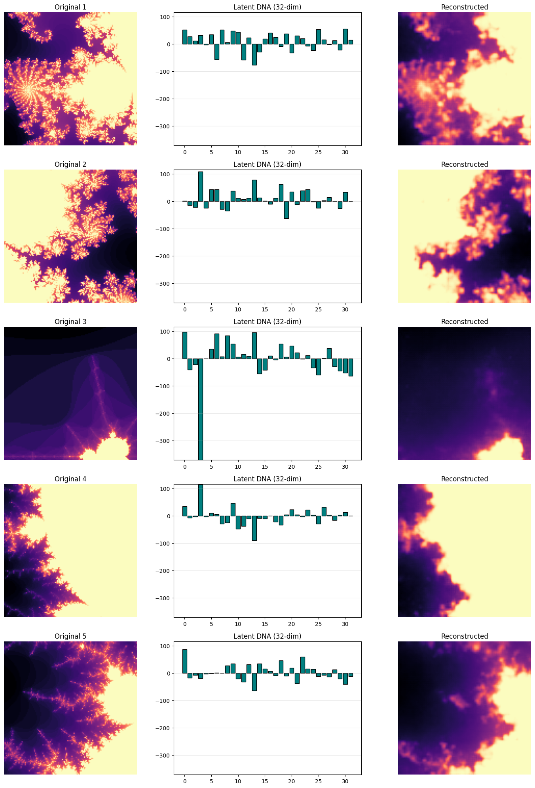
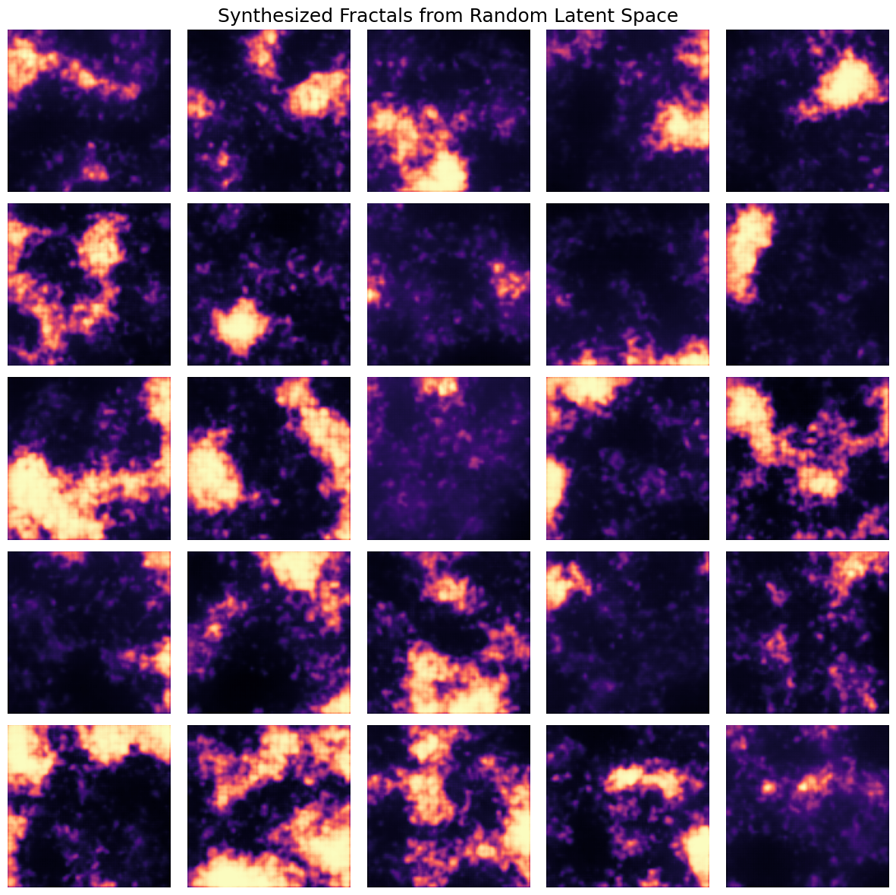
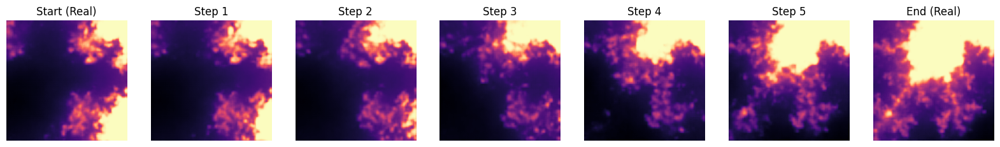

# Brot-AE: Neural Fractal Compression

Brot-AE is a deep convolutional autoencoder trained on images of the Mandelbrot set. 128x128 images are compressed to a 32-dimensional vector and decompressed back to 128x128 minimizing loss. To preserve some contrast, the custom loss function compares Sobel edge-detected versions of the input and output images.

Running just the decoder part on random 32D vectors yields some fractal-esque synthetic images:

Smooth morphing animations can be produced by linearly interpolating in the latent space:

